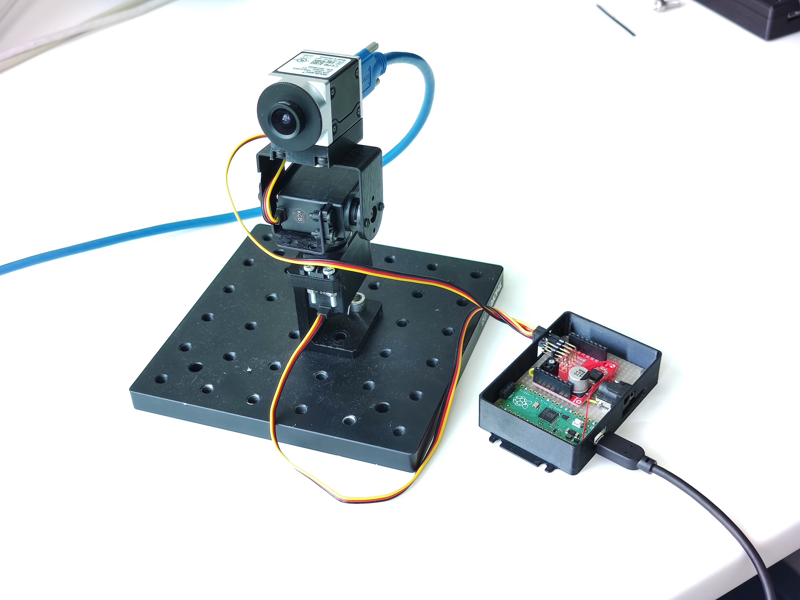

# Fast-Lock-On (FLO) hardware

**ℹ️ The main FLO repository is at https://github.com/strawlab/flo ℹ️**.

This repository hosts hardware design files and other large, binary files.

FLO is a method for videography using a camera system that automatically moves
to follow the subject.

FLO is described in the following publication:

[FLO paper]: https://doi.org/10.1101/2023.12.20.572558

Vo-Doan TT, Titov VV, Harrap MJM, Lochner S, Straw AD. High Resolution Outdoor Videography of Insects Using Fast Lock-On Tracking. bioRxiv (2023) [doi:10.1101/2023.12.20.572558][FLO paper].

## What is in this repository

### Mini-FLO

A bare-minimum hardware

### BYO-camera setup

"Bring Your Own Camera".

The setup for filming flying bees carrying a retroreflective marker.

[hardware description is in ./byo directory](./byo/readme.md)

.jpg>)
