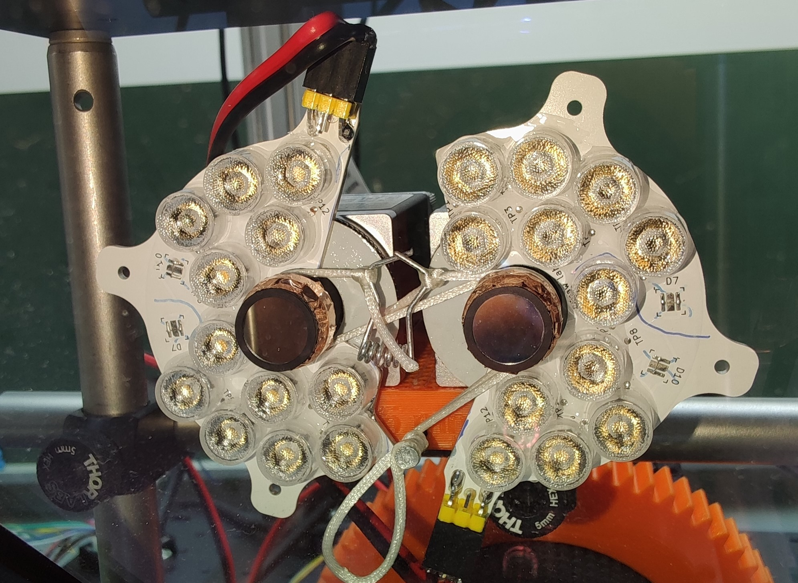

# Bill of materials

see [bom.xlsx](./bom.xlsx)

PCB files are made in KiCAD 7.0.

Some 3d-printing models were done in FreeCAD 0.21.0.32457 (pre-release of v0.21); Lattice2 and Part-o-magic community add-ons are required for editing the FreeCAD models. 

Other 3d-printing models were done in Autodesk Inventor.

The 3d models of parts are also provided in STEP and STL formats; gcode files are sliced for Prusa i3 MK3 3d printer with 0.4mm nozzle.

# System description

## overall design

## tracking cameras and illumination system

The `beam-driver` board sends trigger pulses to the two tracking cameras. The cameras send back an ExposureActive signal, which are ORed together, passed through the microcontroller (to limit the max pulse width to protect the leds and the driver from misconfiguration of exposure times) to drive the 850 nm LED beam source. Image data is sent to the PC via usb3.

Nominal exposure time is 50 microseconds, the default framerate is 150 Hz.

### beam-driver board

### beam source

These rings were designed for a different setup, and don't quite fit on the cameras of the BYO setup because they are too close to each other. So we've cut these boards, and also left some LEDs unpopulated. There is a pcb layout for the cut-down version, see `/led-ring-v2/led-ring-v2-cut`. The photo below shows the manually-cut variant of the full ring.

### trigger cable

see [trigger cable assembly instruction](../trigger-cable/trigger-cable.md)

### tuning led current

Supply voltage directly affects the peak current of the beam source LEDs. The range allowed by the board itself is 9 to 35 V, but the actual range must be determined experimentally for each LED source. 

For our beam source (2 boards of 6-series-2-parallel SFH4715AS LEDs), the maximum supply voltage is 24 V.

1) determine the maximum current for your beam source. For example, our board uses SFH4715AS, which has a peak current rating of 3 A. We have a total of 4 string in parallel (2 strings per led board and 2 led boards), so the total current to be seen by the driver is 4 * 3 = 12 A.

2) connect one camera to the beam-driver board. Configure it for 50 us exposure. (signal generator can be used instead of a camera)

3) power the board from an adjustable power supply set to 9 V, and verify (with an oscilloscope) that you see 50-microsecond-wide pulses on the gate of the mosfet.

4) connect an oscilloscope to the SMA connector on the board with a coax cable, and set the probe division ratio to 20x (because the sense resistor is 0.05 Ohms), and the unit to Amps. (do not use 50-ohm termination on the scope).

5) crank up the supply voltage until the current pulse amplitude reaches the wanted value (12 A). Write down the voltage.
