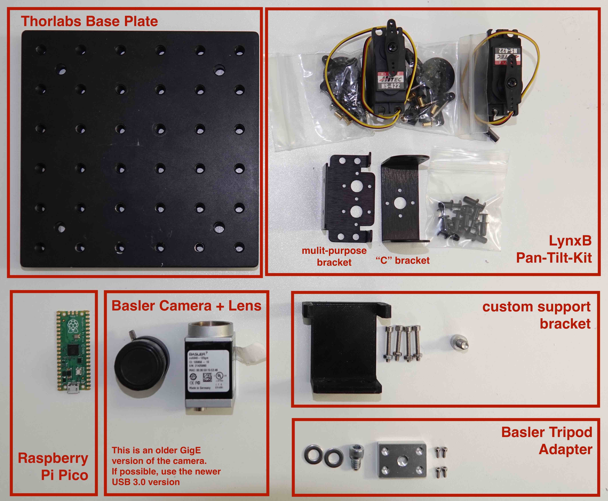
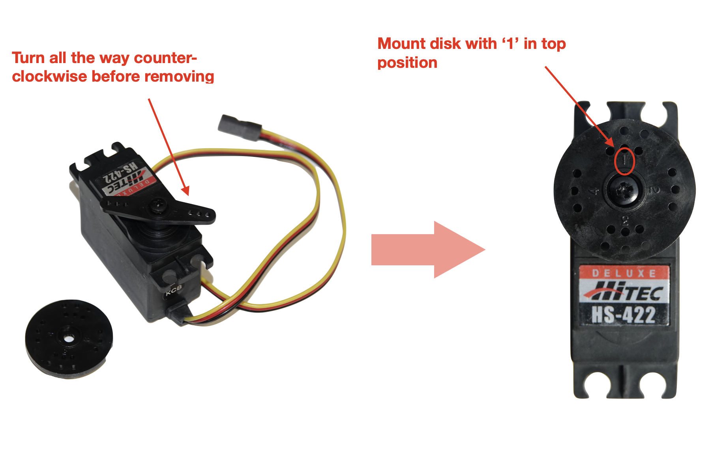
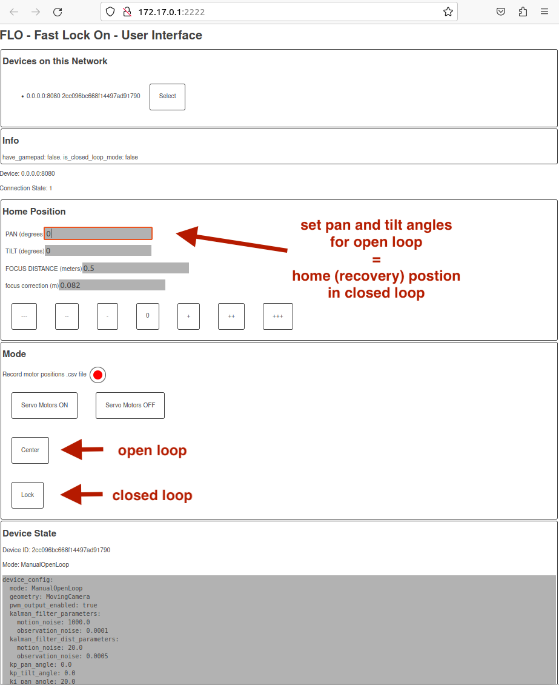

# Build instructions and user manual for the proof-of-concept Mini-Pan-Tilt (MPT) version of the Fast-Lock-On (FLO) insect tracking system

This manual is a step-by-step guide to assemble a mini-pan-tilt setup from
scratch and run it on an Ubuntu Linux machine.

## Bill of Materials

All parts but one, the custom 3D-printed support bracket _(CAD file included)_ are available as off-the-shelf components.

### Mechanical parts

- 1x Lynxmotion: Lynx B - Pand and Tilt Kit (Black Anodized), inluding:

  - 1x Aluminum Multi-Purpose Servo Bracket Single (ASB-04)
  - 1x Auminum "C" Servo Bracket Single (ASB-03)
  - 2x HS-422 standard servo (S422)
  - Hardware (in particular: 4x small black screws for servos, 1x black M1 screw with washer and nut for tilt axis, nylon rivets)

  There seems to be the newer version of this kit, available [here](https://www.robotshop.com/products/lynxmotion-pan-and-tilt-kit-aluminium2).

- 1x [Thorlabs base plate 150x150x12.7 mm, M6 Taps](https://www.thorlabs.de/thorproduct.cfm?partnumber=MB1515/M) +

- 1x custom 3D printed support bracket (include file)

- 1x Basler Tripod Adapter, compatible with camera (see [below](#optical), e.g. [this one](https://www.edmundoptics.eu/p/ace2-14-tripod-mount-adapter/44087/)). Alternatively, there is also a 3D [printed version](linktofile) of this part. (inlude link
  )
- assorted screws

  - 4x M3x20 cap screws + nuts

  - 1x M6 cap screw

  - screws required for the camera adapter

### Electronics

- [Raspberry Pi Pico](https://www.raspberrypi.com/products/raspberry-pi-pico/) microcontroller
- optional: breadboard jumper wires

### Optical

- Basler or Vimba high-framerate, USB 3.0 camera: highly recommended [Basler Ace2 a2a1920-160mBAS](https://www.baslerweb.com/en/shop/a2a1920-160umbas/)
- CS-mount lens of desired specifications. Recommended for this basic setup: f=16mm A=1:1.6
- optional: IR-bandpass filter for better signal-to-noise ratio



## Hardware build instruction

1. Mount camera on "C" bracket :
   - Attach tripod adapter to base of camera
   - Attach "C" Bracket to Adapter


2. For each servo motor, replace the preinstalled "arm" with the disk shaped one:
   - turn the servo all the way counter-clockwise
   - remove arm
   - mount disk with '1' in the top position



3. Mount multi-purpose servo bracket to pan-servo:
   - turn disk unitl '2' is in the top position
   - attach Multi-Puropse bracket in parallel with the servo. Use small balck screws to attach bracket to disk


4. Mount tilt-servo:
   - attach one side of "C" bracket (with mounted camera) to the multi-purpose backet
   - mount tilt-servo to multi-purpose bracket using nylon rivets
   - **turn disk on tilt-servo to have '3' in top postition**
   - attach loose end of "C" bracket to disk. Make sure that the disk is in the right position!


5. Mount on base plate: - Attach 3D printed support bracket to base plate with M6 screw - attach pan-servo to support bracket using M3 x 20 screws and nuts


6. Mount desired lens on camera

## Connecting the Raspberry Pi Pico

Each servo motor needs three connections to the microcontroller, representing

- black: GND
- red: VCC (Power)
- yellow: PWM, pulse (control)

These need to be soldered to the pins of the RPi Pico as follows

- gpio7 (PIN10): PWM tilt
- gpio6 (PIN9): PWM pan
- VBUS (PIN40): VCC of both servos
- arbitrary GND pins: GND of both servos


either directly or via breadboard jumper cables (see below)


## Software & firmware installation

At present, the Beetrax system is based on two separate interacting software components operating in closed loop:

1. `strand-cam`: a multi- or single-camera visual tracking system, which provides positional information of the target to
2. `flo`: a fast-lock-on, closed-loop system controlling the movement of the camera(s) to keep them pointing toward the target

Both are written in `rust` and therefore require a working [rust installation](https://rustup.rs/) to build from source.

### 1. Install `strand-cam` via .deb package

> [!attention] Not tested yet!!

Install your camera drivers. Currently [Basler Pylon](<https://docs.baslerweb.com/software-installation-(linux)>) and Allied Vision Vimba are supported. It is highly recommended to use Basler components for this setup.

Connect the USB 3.0 camera to your machine and make sure that the `pylon Viewer` app recognizes the camera.

Now you can install strand-cam `version 0.12.0` or greater from https://github.com/strawlab/strand-braid.

`strand-cam` can now be opened globally by running

```sh
strand-cam-pylon
```

in the terminal. A new tab with the `strand-cam` browser-user-interface (BUI) will automatically open in your default browser.

### 2. Build `flo` from source

In a new terminal, clone the repository in to a location which will below be
called `/path/to/flo` and checkout `flo` as follows:

```bash
cd /path/to # <----change this to a suitable filesystem directory
git clone https://github.com/strawlab/flo
```

Install prerequisites for building the browser user interface (BUI):

- Install wasm-pack from here https://rustwasm.github.io/wasm-pack/installer/
- Install grass by running the following: `cargo install grass`

Next, we need to build the BUI:

```bash
cd /path/to/flo/crates/flo-bui
./build.sh
```

#### 2. Flashing firmware: PanTilt for RP-pico - Receive from USB (serial) and emit PWM for two servos

The following instructions how to flash rust firmware onto the RPi Pico is based on [rp2040-project-template](https://github.com/rp-rs/rp2040-project-template).

#### Installation of development dependencies

```sh
rustup target install thumbv6m-none-eabi
cargo install flip-link
cargo install elf2uf2-rs --locked
```

#### Running: We are going to load a UF2 over USB

First, navigate to `path/to/flo/firmware/rpipico-pantilt/`, which contains the firmware for the Raspberry Pi Pico.

_Step 1_ - Boot RP2040 into "USB Bootloader mode". Keep "BOOTSEL" button pressed while connecting to the PC. It should now be mounted in 'Flash drive' mode.

_Step 2_ - Use `cargo run`, which will compile the code and start the specified 'runner'. As the 'runner' is the `elf2uf2-rs` tool, it will build a UF2 file and copy it to your RP2040.

For a debug build:

```sh
cargo run
```

For a release build:

```bash
cargo run --release
```

### 3. configure `flo`

Navigate to `/path/to/flo`.

The `config-mini.yaml` file contains the specific configuration for the Mini-Pan-Tilt setup. Depending on your choice of camera and lens, you might need to modifiy the following lines:

```
centroid_to_sensor_x_angle_func:
# needs to be adjusted to specific camera/lens combitnation
  dx_gain: 0.00035 # 5.6 / 16mm (px pitch / focal length)
  dy_gain: 0.0
  offset: 0.0
centroid_to_sensor_y_angle_func:
  dx_gain: 0.0
  dy_gain: -0.00035 # same here, minus sign due to mounting
  offset: 0.0
```

### 4. run `flo` in open loop

Run flo with with the serial device and config file specified. Depending on your system, the path to the serial device might differ. In `/path/to/flo/pan-tilt-pc/` run

```bash
cargo run --release -- --pwm-serial /dev/serial/by-id/usb-Straw_Lab_Serial_port_TEST-if00 --config config-mini.yaml
```

The `flo` BUI is now available at several IP-addresses which are printed in the terminal window. You can open the BUI by `ctrl`- click on the IPs.


The BUI will open up in a new browser tab in 'manual open loop' mode. Make sure the system behaves appropriately when setting new values for PAN and TILT of the home position. Unexpected behavior may occur if the motor positions during assembly were not as specified.



### 5. configure `strand-cam`

If not already running, open `strand-cam` in a new terminal. The `strand-cam` BUI should open up in a new browser tab.


Scroll down to the `Camera Settings' section and adjust exposure to improve signal-to-noise ratio, i.e. the tracked object (e.g. bright LED) should be visible and the background dark.


Next, go to the 'ImOps Detection' section and enable it. Set the `Center X` and `Center Y` fields to the center of your image in pixels (can be determined from the 'Live view' section). Finally, set the sensitivity `Threshold` to 200.

In the 'Live view' window, there should now be a black circle which tracks the target. The ImOps data should now be broadcast to `flo`.


### 6. run `flo` in closed loop mode

Go back the `flo` browser tab and click the `Lock` button. The camera should now lock on to the target when it enters the field of view.
