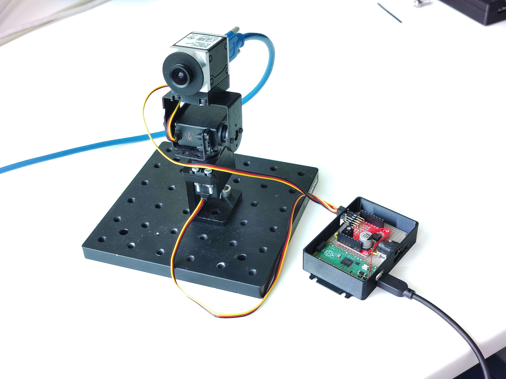

# Fast-Lock-On (FLO) hardware

## Mini-FLO

A bare-minimum hardware

## BYO-camera setup

The setup for filming flying bees carrying a retroreflective marker.

[hardware description is in ./byo directory](./byo/readme.md)

.jpg)