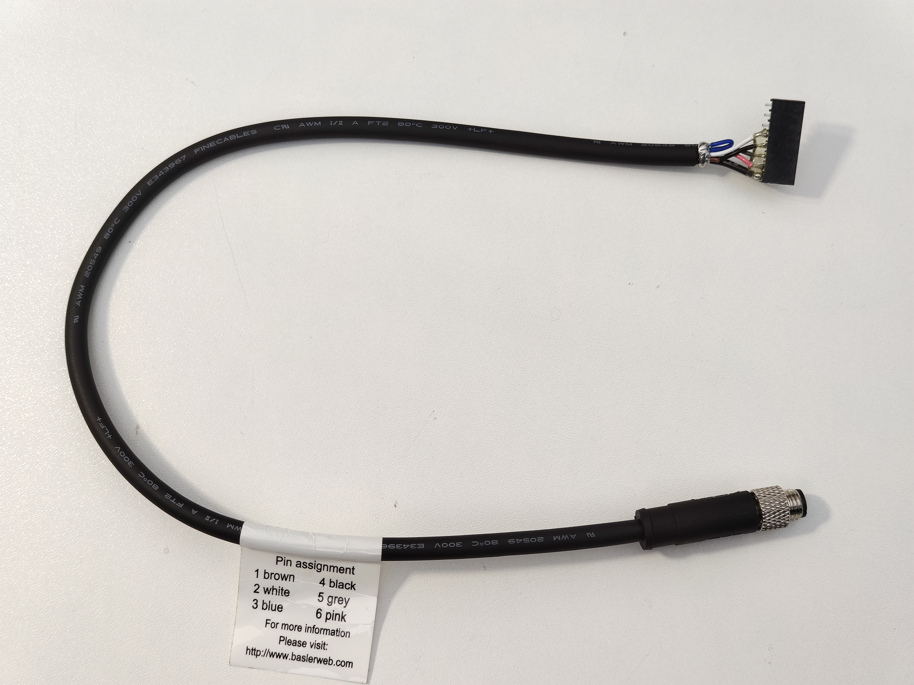

# Trigger cable

The trigger cable connects `led-driver` board to a tracking camera. 
Two cables are needed for two cameras.

## BOM

* Basler 2200000315
* 8x1-pin 0.1-inch socket

## Pinout

| camera connector pin  | wire color | signal        | pcb connector pin |
|-----------------------|------------|----------     |-------------------|
| 1 (nc)                | brown      | none          | none              |
| 2 (Line1)             | white      | not used      | 4                 | 
| 3 (Line1 return)      | blue       | ground        | 7, 8              | 
| 4 (Line2)             | black      | <-- trigger   | 5                 | 
| 5 (Line3)             | grey       | exposure -->  | 6                 | 
| 6 (gpio ground)       | pink       | ground        | 7, 8              | 
| shield (camera case)  |            | ground        | 7, 8              | 
|                       |            | (connector key) | 1 (plug / missing pin)              |